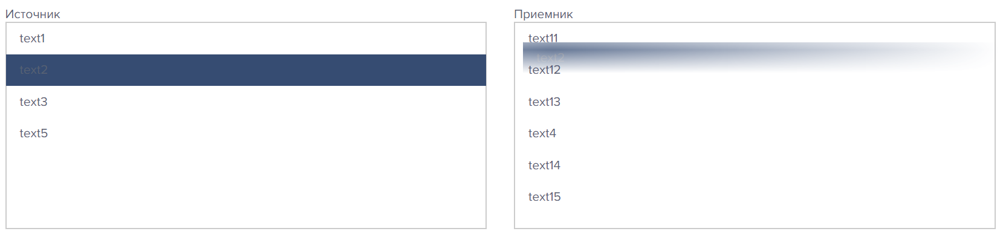

# ui-list-View

ui-date-picker component for Vue 2.x
 
Компонент для работы со списками элементов


## Screenshot


```html
<template>
  <div>
    <div class="row">
      <div class="col">
        <div>Источник</div>
        <ui-list-view :Items="tasklistSource" :fromJSON="x" style="height:100%; border:1px solid #ccc" isDrageble>
        </ui-list-view>
      </div>
      <div class="col">
        <div>Приемник</div>
        <ui-list-view :Items="tasklistTarget" :fromJSON="x"  style="height:100%; border:1px solid #ccc" isDrageble>
        </ui-list-view>
      </div>
    </div>
  </div>
</template>


  tasklistSource:any[]=[];
  tasklistTarget:any[]=[];
  x:Function = TaskModelSimple.NewObjectFromJSon

  created(){
    this.tasklistSource.push(new ListViewItem(new TaskModelSimple(1,"text1"),false,false))
    this.tasklistSource.push(new ListViewItem(new TaskModelSimple(2,"text2"),false,false))
    this.tasklistSource.push(new ListViewItem(new TaskModelSimple(3,"text3"),false,false))
    this.tasklistSource.push(new ListViewItem(new TaskModelSimple(4,"text4"),false,false))
    this.tasklistSource.push(new ListViewItem(new TaskModelSimple(5,"text5"),false,false))

    this.tasklistTarget.push(new ListViewItem(new TaskModelSimple(11,"text11"),false,false))
    this.tasklistTarget.push(new ListViewItem(new TaskModelSimple(12,"text12"),false,false))
    this.tasklistTarget.push(new ListViewItem(new TaskModelSimple(13,"text13"),false,false))
    this.tasklistTarget.push(new ListViewItem(new TaskModelSimple(14,"text14"),false,false))
    this.tasklistTarget.push(new ListViewItem(new TaskModelSimple(15,"text15"),false,false))
  }
```


####TaskModelSimple.ts
```html

import IEqual from "scripts/frameworks/iequal";

export default class TaskModelSimple implements IEqual<TaskModelSimple> {
  id: number;

  name: String;
  public constructor(id: number, name: String) {
    this.id = id;

    this.name = name;
  }

  public Equal(object: TaskModelSimple) {
    return this == object;
  }
  public EqualRelation(object: TaskModelSimple): boolean {
    return null;
  }
  public ToString() {
    return `${this.name}`;
  }
  public static NewObjectFromJSon(obj: object) {
    return new TaskModelSimple(obj.Value.id, obj.Value.name);
  }
}
```

## Instllation

```bash
$ npm install ui-list-view
```

## Usage

```html
<template>
<div class="ui-list-view" @dragover.prevent @drop="dargDrop">
    <template v-for="(item, index) in innerItems">
      <ui-list-view-item
        :draggable="isDrageble && !item.Disabled"
        :key="index"
        :item="item"
        :title="item.Value.ToString()"
        @itemdrop="itemDragDrop"
        @itemDragStart="itemDragStart"
        @itemdropend="itemDropEnd"
        @select="onSelect"
        :class="{underline:underline}"
        :style="itemStyle"
      >
        <slot name="default" :item="item" :select="onSelect"></slot>
        <slot name="hover" :item="item" :select="onSelect"></slot>
      </ui-list-view-item>
    </template>
  </div>
</template>

<script lang="ts">{

innerDate1:Date=new Date();

...
  onChangeDate1(date:Date){
    //console.log(date)
    
  }
}
</script>

```
## Prop

| Prop                  | Type               | Default     | Description                              |
|-----------------------|--------------------|:-----------:|---------------------------------------|
| Items                 | Array              | () => {}    | Исходные данны                       |
| multiselect           | Boolean            | false       | Включить множественный выбор          |
| isDrageble            | Boolean            | false       | Включить возможность перетаскивания   |
| underline             | Boolean            | false       | отобразить линию под элементом списка |
| fromJSON              | Function           | Date        | функция для пополнения элементов при перетаскивании | 
| itemStyle             | String             | ""          | задаем стиль для элементов списка     |


## Event

| Event                 | Return parametr type | Description                              |
|-----------------------|----------------------|------------------------------------------|
| select                | ListViewItem\<any>    | возвращает выбранный элемент             |
| onDrag                | ListViewItem\<any>    | (срабатывает если бросаем на listItem) возвращает брошенный элемент       |
| dragStart             |    | срабатывает когда начинаем тянуть элемент       |
| dragEnd               |    | срабатывает когда отпускаем      |
| dragDrop              |     | срабатывает на списке который поймал элемент      |


## Template var

эти переменные можно переопределить в файле global.less.js, чтобы добиться нужных цветов

```html
<style lang="less" >
@uiListViewItemSelectedBgColor: #1b283f;
@uiListViewItemHoverBgColor: #354c74;
@uiListViewItemDisabledBgColor: gray;


@uiListViewTabsActiveColor: white;
</style>
```


## License

[The MIT License](http://opensource.org/licenses/MIT)

